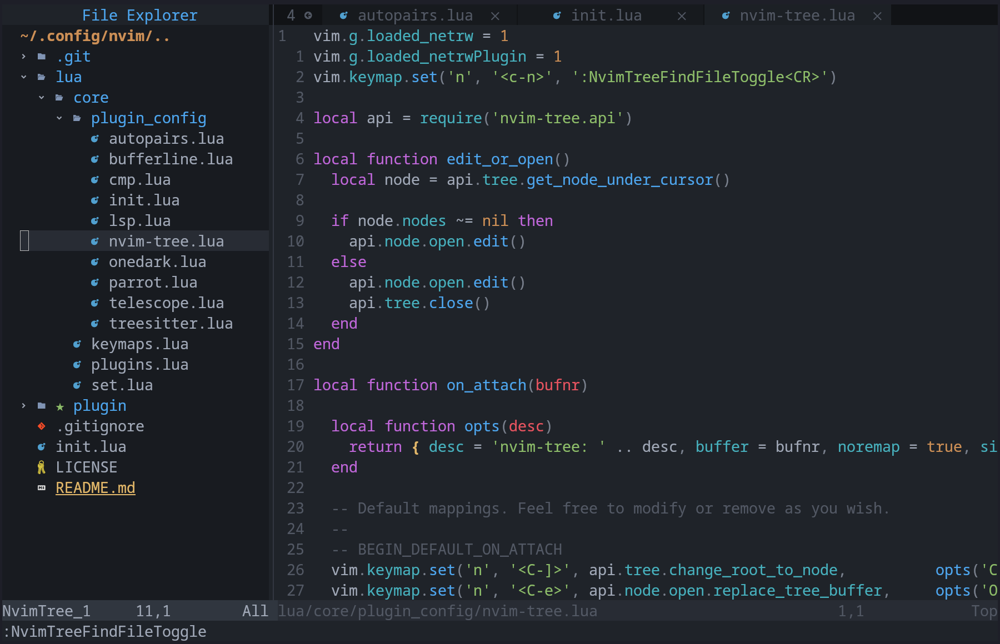

## NvSigma
### Self-configured neovim dotfiles



#### Installation
Just clone this repo inside your nvim config directory. mostly located at:
```bash
$HOME/.config/nvim
```

Then open neovim usign `nvim` command and run this command to sync all packages:
```
:PackerSync
```

Finally, your nvim is ready to use. enjoy :)

#### Parrot AI plugin
To activate and use the parrot AI plugin, just set gemini env in your terminal. (This is temporary and when you close your terminal it will be deleted.):
```bash
export GEMINI_API_KEY=YOUR_API_KEY
```

Done! open nvim and use `:Prt` sub-commands.
